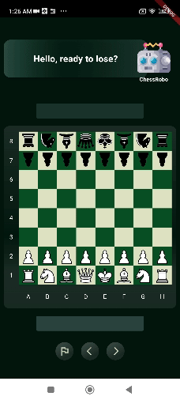
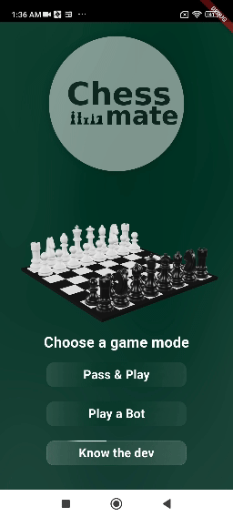
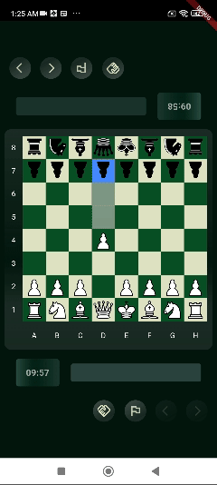
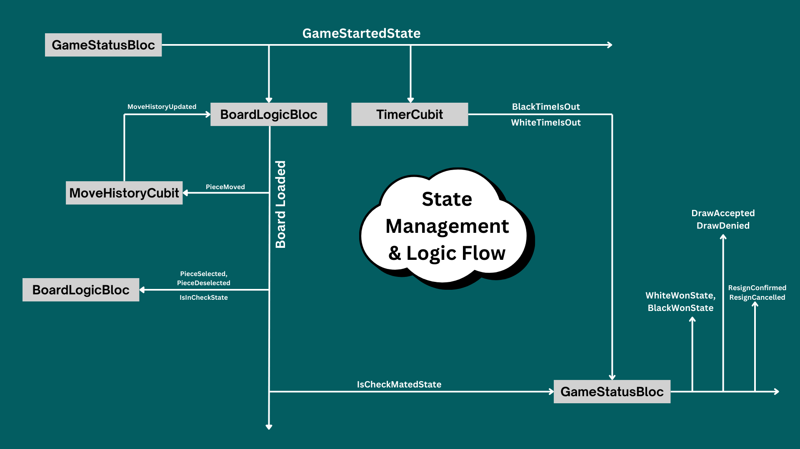
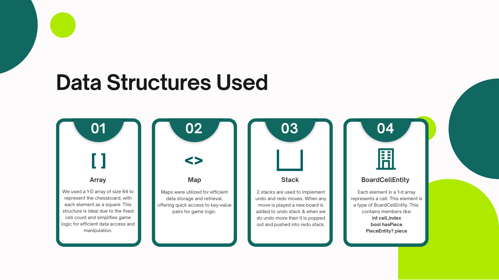
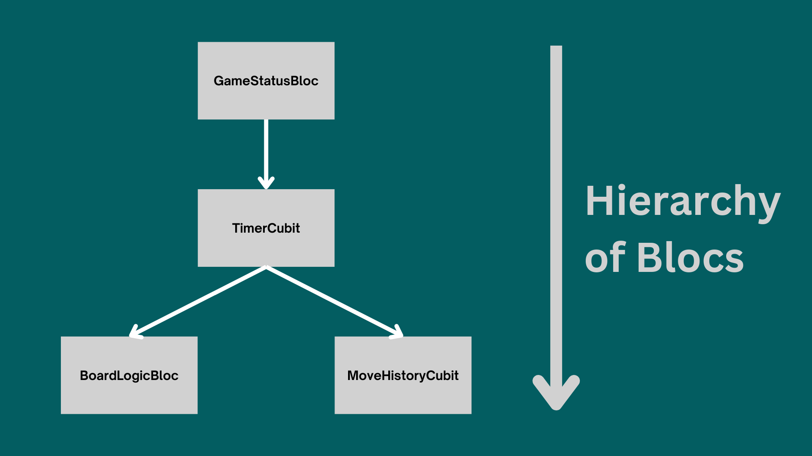

  <table>
    <tr>
      <td>
        
      </td>
      <td>
        <h1><b>ChessMate - Ultimate Chess Experience</b></h1>
      </td>
    </tr>
  </table>

## Download ChessMate 📥

> 📢 *Coming Soon on Play Store! (Currently under review)*

---

## 📱 Live Demo - ChessMate in Action

  
  
  
  

---

## Chess Logic

> *Understanding the architecture of ChessMate*  

  
    
  
    
  

---

## ♟️ Features

 **Play 1v1 Locally** – Challenge a friend on the same device.  
 **Play Against AI (1vBot)** – Battle a chess bot with smart AI.  
 **Beautiful UI & Smooth Animations** – Enjoy a premium chess experience.  
 **Move Validation** – Ensures only legal moves are allowed.   
 **Game State Management with Bloc** – Ensures smooth state transitions.  

---

## 🛠️ Tech Stack

- **Flutter** – Cross-platform mobile framework.  
- **Bloc (State Management)** – Manages the game logic efficiently.  
- **Custom Chess Engine** – Minimax with Alpha-Beta pruning for bot AI.  

---

## 🎯 Future Roadmap

**Multiplayer Online Mode** (Coming Soon)  
**Difficulty Levels for Bot**  
**Custom Themes & Boards**  
**Leaderboard & Stats Tracking**  

---

## 🤝 Contributing

📧 For suggestions: [jainanuj.work@gmail.com](mailto:jainanuj.work@gmail.com)

---

## 📜 License

This project is licensed under the MIT License. See the [LICENSE](LICENSE) file for details.

---

### ⭐ If you like this project, give it a star on GitHub! ⭐
